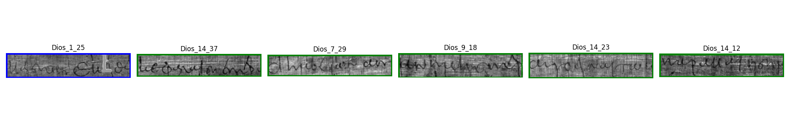
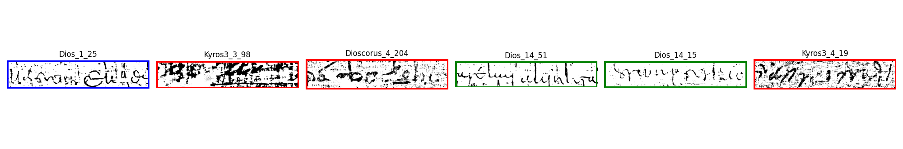
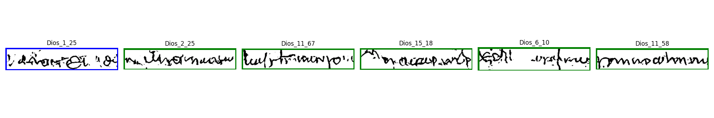

# hip23-data

# hip23
Additional repository of 

Marco Peer and Robert Sablatnig: **Feature Mixing for Writer Retrieval and Identification on Papyri Fragments** at HIP@ICDAR2023. Our code is available in the corresponding [repository](https://github.com/marco-peer/hip23). [Paper on arXiv](https://arxiv.org/abs/2306.12939)

The repository contains the three versions of the PapyRow dataset (they will probably be moved to another location soon):

1. color - the original version as proposed in the paper
2. sauvola - binarized version using Sauvola's algorithm
3. unet - binarized version using a U-Net with Tormentor augmentations

In the models directory, the trained networks are saved (trained on ID 4) - to reproduce the retrieval results, e.g.

  
  
  

Please consider citing our paper if you find it helpful

    @InProceedings{Peer_2023_HIP,
        author    = {Peer, Marco and Sablatnig, Robert},
        title     = {Feature Mixing for Writer Retrieval and Identification on Papyri Fragments},
        booktitle = {accepted for presentation at HIP@ICDAR2023: 7th International Workshop on Historical Document Imaging and Processing},
        month     = {August},
        year      = {2023},
    }

If you have questions, do not hesitate to contact me mpeer(at)cvl.tuwien.ac.at

